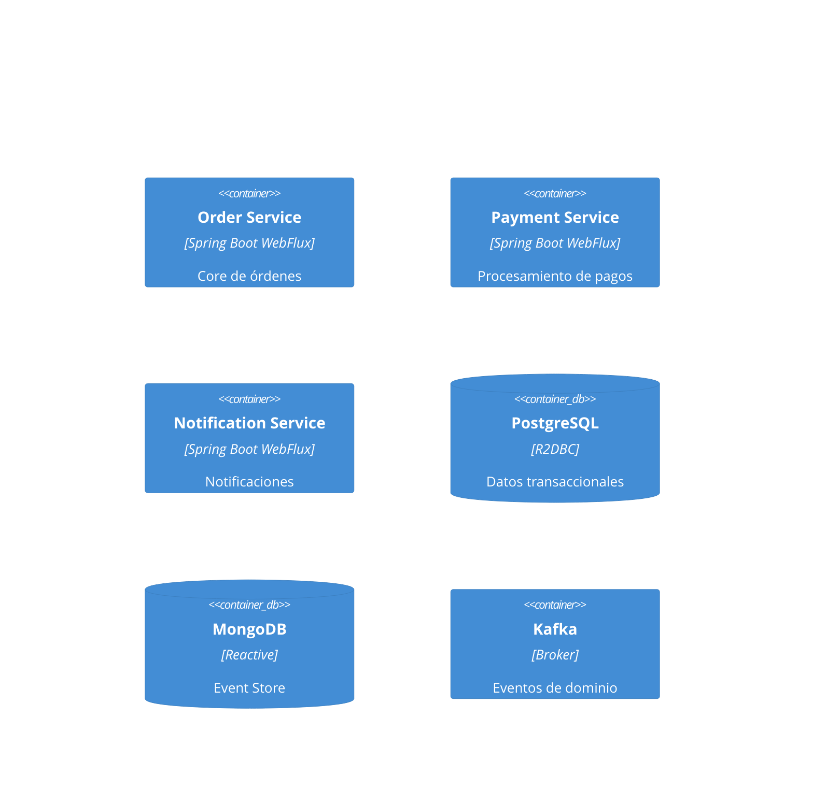

# Diagrama de Componentes (Texto + Mermaid)

```mermaid
C4Container
    Container(orderService, "Order Service", "Spring Boot WebFlux", "Core de órdenes")
    Container(paymentService, "Payment Service", "Spring Boot WebFlux", "Procesamiento de pagos")
    Container(notificationService, "Notification Service", "Spring Boot WebFlux", "Notificaciones")
    ContainerDb(pg, "PostgreSQL", "R2DBC", "Datos transaccionales")
    ContainerDb(mongo, "MongoDB", "Reactive", "Event Store")
    Container(kafka, "Kafka", "Broker", "Eventos de dominio")
```
