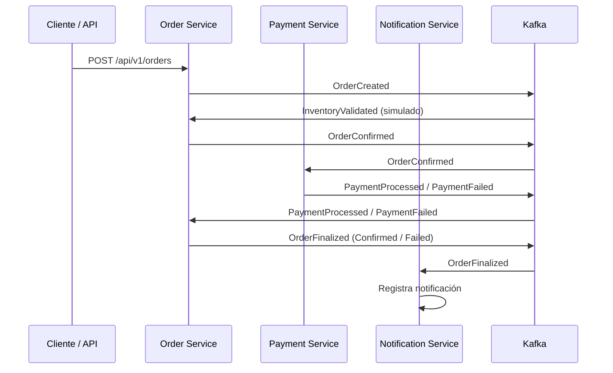

# Flujo de Eventos entre Servicios

```mermaid
sequenceDiagram
    participant API as Cliente / API
    participant OS as Order Service
    participant PS as Payment Service
    participant NS as Notification Service
    participant K as Kafka

    API->>OS: POST /api/v1/orders
    OS->>K: OrderCreated
    K->>OS: InventoryValidated (simulado)
    OS->>K: OrderConfirmed
    K->>PS: OrderConfirmed
    PS->>K: PaymentProcessed / PaymentFailed
    K->>OS: PaymentProcessed / PaymentFailed
    OS->>K: OrderFinalized (Confirmed / Failed)
    K->>NS: OrderFinalized
    NS->>NS: Registra notificación
```
